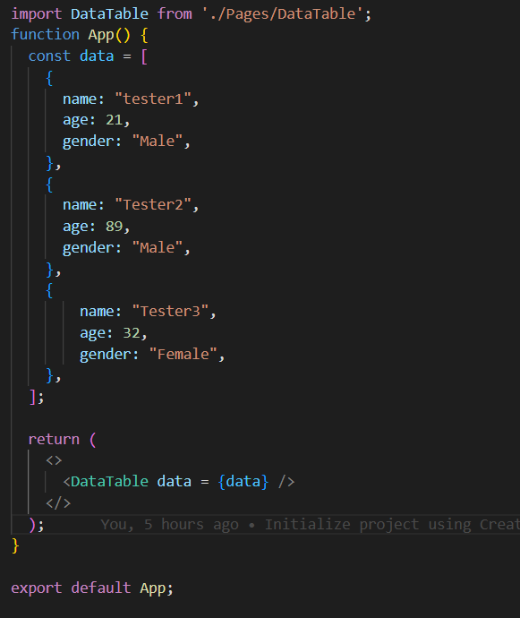

# Data_Table

This data-table component render your data in a table style and add edit and delete buttons to each row

## NB:

This dataTable use tailwindcss make sure to add it proparly in your project
## how to use :

prepare your data as array of objects (Object[]) and send it in the component props :

## parent component : 
Your parent component should looks something like this : 

      

## update & delete :
currently im working on the update and the detele buttons
--for the moment if you clicked on the update or the delete button it will show you in your console an array contain all the values of that row

